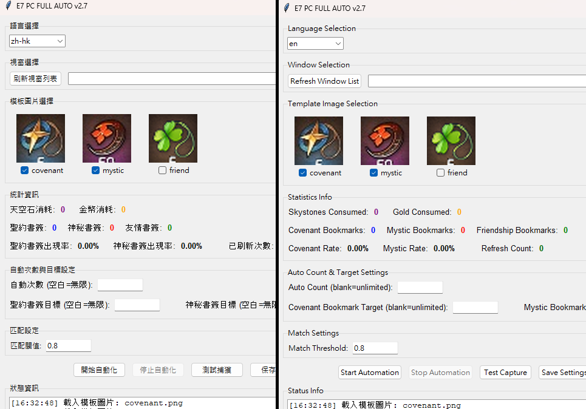

# Epic7 PC版自動刷新神秘商店 v2.7



Demo / User Guide : https://youtu.be/rcPtGO7zkzk

## 項目介紹

Epic7 自動刷新神秘商店工具，不鎖定滑鼠，Code基本上都是 AI 寫的，如果遇到 bug 請Create Issue。歡迎 fork 或 contribute，Give me a Star if you like it！

### v2.7 新功能
- ✅ **多語言支援 (i18n)** - 支援中文繁體和英文，可輕鬆添加新語言

## 使用說明

### 重要步驟
1. **Window顯示縮放設為 100%**
2. **右鍵程式選擇「以系統管理員身分執行」**
3. **刷新時不要移動滑鼠到遊戲視窗內**
4. **刷新時不要最小化遊戲視窗**

### 注意事項
- 程式需要管理員權限才能自動點擊遊戲

### 多語言支援
程式支援多語言介面，目前內建中文繁體 (zh-hk) 和英文 (en)。

**切換語言：**
- 在程式介面上方有語言選擇下拉選單
- 選擇語言後介面會立即更新
- 語言偏好設定會自動儲存

**添加新語言：**
1. 開啟 `translations.json` 檔案
2. 複製現有的語言區塊 (例如 "zh-hk" 或 "en")
3. 將新語言代碼設為 key (例如 "ja" 代表日文)
4. 翻譯所有文字內容
5. 儲存檔案後重新啟動程式，新語言會自動出現在下拉選單中

範例：
```json
{
  "ja": {
    "window_title": "E7 PC FULL AUTO v{version}",
    "start_automation": "自動化開始",
    // ... 翻譯所有其他項目
  }
}
```

## TODO 清單

1. 網絡loading 後重試

## 自己編譯

1. clone 此專案
2. 執行 `install.bat` 安裝所需函式庫
3. 執行 `build.bat` 編譯 .exe 檔案

# Epic7 PC Auto Mystic Shop Refresh v2.7

## About

Epic7 automatic mystic shop refresh tool that doesn't lock your mouse. The code is basically all written by AI. Feel free to create issues if you encounter any bugs. Welcome to fork the project or contribute - if you like it, give me a star!

### v2.7 New Features
- ✅ **Internationalization (i18n) Support** - Supports Traditional Chinese and English, easy to add new languages

## Usage Instructions

### Important Steps
1. **Set Windows display scale to 100%**
2. **Right-click exe and "Run as administrator"**
3. **Don't move mouse to game window while running**
4. **Don't minimize the game window**

### Notes
- Administrator privileges required for automated clicking

### Internationalization Support
The application supports multiple languages, currently including Traditional Chinese (zh-hk) and English (en).

**Switching Languages:**
- Use the language selection dropdown at the top of the interface
- Interface updates immediately after selecting a language
- Language preferences are automatically saved

**Adding New Languages:**
1. Open the `translations.json` file
2. Copy an existing language block (e.g., "zh-hk" or "en")
3. Set the new language code as the key (e.g., "ja" for Japanese)
4. Translate all text content
5. Save the file and restart the application - the new language will appear in the dropdown

Example:
```json
{
  "ja": {
    "window_title": "E7 PC FULL AUTO v{version}",
    "start_automation": "automation start",
    // ... translate all other items
  }
}
```

## TODO List

1. Retry after game loading screen

## Compile It Yourself

1. Clone the project
2. Run `install.bat` to install needed libraries
3. Run `build.bat` to build the .exe

