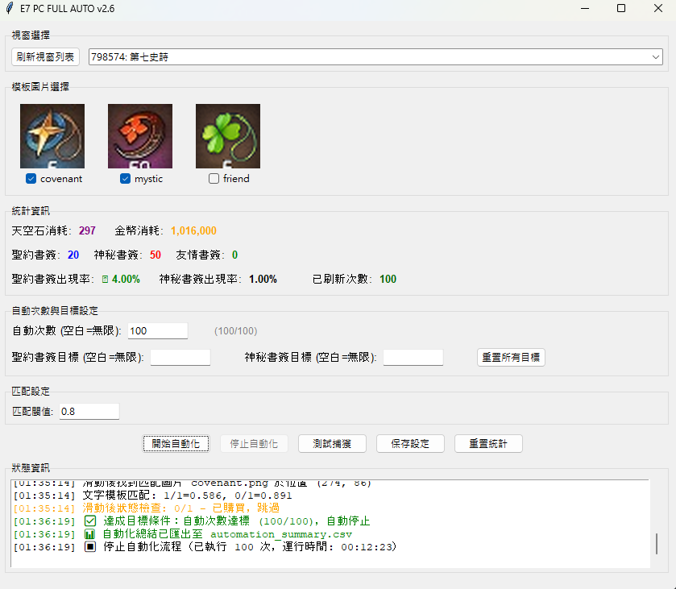

# Epic7 PC版自動刷新神秘商店

## 項目介紹

Epic7 自動刷新神秘商店工具，不鎖定滑鼠，Code基本上都是 AI 寫的，如果遇到 bug 請Create Issue。歡迎 fork 或 contribute，Give me a Star if you like it！

## 使用說明

### 重要步驟
1. **Window顯示縮放設為 100%**
2. **右鍵程式選擇「以系統管理員身分執行」**
3. **刷新時不要移動滑鼠到遊戲視窗內**
4. **刷新時不要最小化遊戲視窗**

### 注意事項
- 程式需要管理員權限才能自動點擊遊戲

## TODO 清單

1. i18n 支援
2. 網絡loading 後重試
3. better版本號控制

## 自己編譯

1. clone 此專案
2. 執行 `install.bat` 安裝所需函式庫
3. 執行 `build.bat` 編譯 .exe 檔案

# Epic7 PC Auto Mystic Shop Refresh

## About

Epic7 automatic mystic shop refresh tool that doesn't lock your mouse. The code is basically all written by AI. Feel free to create issues if you encounter any bugs. Welcome to fork the project or contribute - if you like it, give me a star!

## Usage Instructions

### Important Steps
1. **Set Windows display scale to 100%**
2. **Right-click exe and "Run as administrator"**
3. **Don't move mouse to game window while running**
4. **Don't minimize the game window**

### Notes
- Administrator privileges required for automated clicking

## TODO List

1. i18n support
2. Retry after game is loading
3. Better version number control

## Compile It Yourself

1. Clone the project
2. Run `install.bat` to install needed libraries
3. Run `build.bat` to build the .exe

